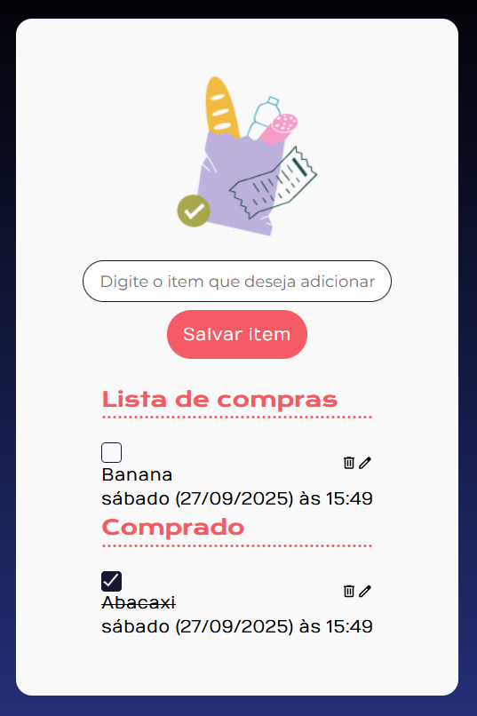

## 📋 Alulist

A **Alulist** é uma página dinâmica de **lista de compras**, desenvolvida para praticar **JavaScript** junto com HTML e CSS. O projeto permite **adicionar produtos, editar, remover e marcar itens como comprados**, oferecendo uma experiência prática no desenvolvimento de páginas interativas.

 

## 🚀 Sobre o Projeto

Este projeto foi desenvolvido durante o curso da Alura:

* "JavaScript: construindo páginas dinâmicas"

A **Alulist** tem como objetivo proporcionar a prática de **integração entre HTML, CSS e JavaScript**, construindo elementos de forma dinâmica, reagindo a eventos do usuário e organizando funcionalidades em diferentes arquivos JavaScript. A aplicação também foca na **usabilidade**, permitindo que os usuários gerenciem facilmente suas listas de compras.

## 📚 Objetivos do Curso

* Praticar conhecimentos de **HTML e CSS**;
* Aprender a **integrar o HTML com arquivos JavaScript**;
* Implementar diversos tipos de **funções** com JavaScript;
* Construir elementos de forma **dinâmica**;
* Detectar e responder **eventos do usuário** na tela da aplicação;
* Utilizar **seletores** para encontrar elementos dentro da aplicação de acordo com seus identificadores;
* Separar as **funções JavaScript em arquivos diferentes**.

## 🛠️ Tecnologias Utilizadas

🖼️ Visualização do Projeto
## 🖼️ Visualização do Projeto

Uma prévia das principais funcionalidades da **Alulist**:

**🌐 Acesse o Projeto Online**

O projeto está disponível para visualização na **Vercel**. Clique no link abaixo para acessar:

**📨 Página da Lista de Compras**

Seção interativa com campos para inserir produtos, botões de ação para editar e remover, além de funcionalidades para marcar itens como comprados.

